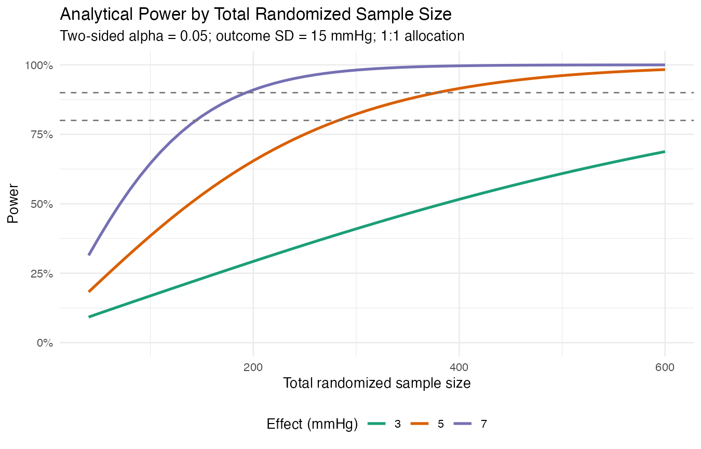

# Clinical Trial Design & Power Simulation

**Objective:** Evaluate sample-size requirements and operating characteristics for a hypothetical 12-week, two-arm randomized trial of Treatment A versus placebo for reducing systolic blood pressure.

**Methods:** Two-sample analytical sample size, Monte Carlo power simulation, ANCOVA adjusted for baseline blood pressure, dropout sensitivity, 1:1 versus 2:1 allocation, and baseline-correlation scenarios.

**Tools:** R, ggplot2, R Markdown, Git

**Primary estimand:** Mean treatment difference in 12-week systolic blood pressure among randomized participants under the data-generating and missingness assumptions defined in the simulation.

**Deliverables:** [HTML report](docs/index.html) | [Simulation results](output/tables/simulation_power_results.csv) | [Source code](src/) | [Tests](tests/)



## Key findings

- For a 5-mmHg effect, SD 15 mmHg, 10% dropout, and 1:1 allocation, the unadjusted analytical approximation required **314 randomized participants for 80% power** and **422 for 90% power**.
- With baseline-follow-up correlation 0.60, the planned ANCOVA achieved **94.1% empirical power** across 1,000 simulated trials at N = 314 (Monte Carlo SE 0.7 percentage points).
- The empirical power exceeded the unadjusted formula target because ANCOVA reduced residual variance by adjusting for a prognostic baseline measurement. This difference is a design insight, not evidence that simulation and analytical methods disagree.
- Under the same effect and correlation assumptions, 2:1 allocation required 354 randomized participants at 10% dropout and achieved 92.8% empirical power, illustrating the efficiency cost of unequal allocation.

## Study design

- Parallel-group randomized controlled trial
- Continuous primary endpoint: 12-week systolic blood pressure
- Two-sided alpha: 0.05
- Target power: 80% or 90%
- Effect-size scenarios: 3, 5, and 7 mmHg
- Standard-deviation scenarios: 10, 15, and 20 mmHg
- Dropout scenarios: 5%, 10%, and 20%
- Allocation: 1:1 primary; 2:1 sensitivity analysis

## Repository structure

```text
src/       reusable design and simulation functions
tests/     numerical and structural checks
data/      one reproducible synthetic example trial
output/    analysis tables and figures
report/    report source
docs/      rendered report for GitHub Pages
legacy/    original CGM simulation coursework
```

## Reproduce

```bash
Rscript run_all.R
Rscript tests/test_core.R
```

The main simulation uses a fixed seed. Package versions and session information are written to `output/session-info.txt`.

The published results use 1,000 simulations per scenario for a practical portfolio runtime. A protocol-level design would normally increase the number of iterations after narrowing the scenario set.

## Interpretation limits

This is a synthetic design exercise, not evidence about an actual treatment. Simulation-based power is conditional on the specified outcome distribution, treatment effect, dropout mechanism, and analysis model. Design decisions for a real trial require clinical input and protocol-specific assumptions.
