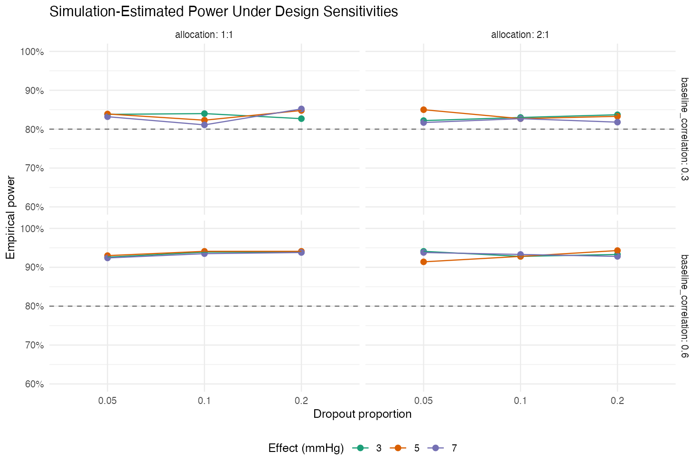

```{r setup, include=FALSE}
knitr::opts_chunk$set(echo = TRUE, warning = FALSE, message = FALSE)
library(ggplot2)
sample_sizes <- read.csv("../output/tables/analytical_sample_size_grid.csv")
sim <- read.csv("../output/tables/simulation_power_results.csv")
```

## Executive summary

This synthetic work sample evaluates the sample size and power of a hypothetical 12-week randomized trial comparing Treatment A with placebo for systolic blood pressure. Formula-based calculations are paired with Monte Carlo simulation to assess the effects of treatment magnitude, outcome variability, dropout, allocation ratio, and baseline correlation. Results are conditional on the stated assumptions and are intended to demonstrate study-design workflow rather than clinical evidence.

## Study objective and estimand

The objective is to estimate the adjusted mean difference in 12-week systolic blood pressure between randomized groups. The planned analysis is ANCOVA with treatment and baseline systolic blood pressure as predictors. Tests are two-sided with alpha 0.05.

## Analytical sample size

The two-group continuous-endpoint approximation is inflated for anticipated dropout and supports 1:1 or unequal allocation.

```{r sample-table}
selected <- subset(sample_sizes, sd == 15 & dropout == 0.10)
knitr::kable(selected, digits = 2, caption = "Selected sample-size scenarios (SD 15; 10% dropout)")
```

```{r power-curve, echo=FALSE, out.width='90%', fig.align='center'}
knitr::include_graphics("../output/figures/power_curves.png")
```

## Simulation-based power

For each scenario, the pipeline generates randomized participants, correlated baseline and follow-up outcomes, MCAR dropout, and an ANCOVA treatment estimate. Empirical power is the proportion of 1,000 simulated trials with a treatment p-value below 0.05. Monte Carlo standard errors quantify simulation uncertainty.

```{r simulation-table}
shown <- subset(sim, effect == 5 & baseline_correlation == 0.60)
knitr::kable(shown, digits = 3, caption = "Simulation results for a 5-mmHg effect")
```

```{r simulation-figure, echo=FALSE, out.width='95%', fig.align='center'}

```

## Interpretation

Larger effects require fewer participants, while greater outcome variability and higher target power require more. Dropout increases the randomized sample needed to preserve the analyzable sample. Unequal allocation is less statistically efficient for a fixed total sample, although it may be justified by safety, recruitment, or operational considerations. Greater baseline-follow-up correlation improves ANCOVA efficiency when baseline is measured reliably.

For the 5-mmHg, SD-15, 10%-dropout, 1:1 scenario, the unadjusted analytical approximation produced N = 314 for 80% power. The ANCOVA simulation at the same randomized N achieved 94.1% empirical power because the baseline covariate explained follow-up variation. This comparison emphasizes that final sample-size work should align the analytical variance assumption with the protocol's planned covariate-adjusted model.

## Limitations

- Data are synthetic and do not represent a real treatment or protocol.
- The primary simulation uses normally distributed outcomes and MCAR dropout.
- Real trial planning should assess nonadherence, treatment discontinuation, protocol deviations, estimand strategy, multiplicity, and clinically informed variance assumptions.
- Simulation results have Monte Carlo error and should be rerun with more iterations for final design decisions.

## Reproducibility

Run `Rscript run_all.R` from the project directory. The seed is fixed, all outputs are regenerated from source, and session information is recorded in `output/session-info.txt`.
