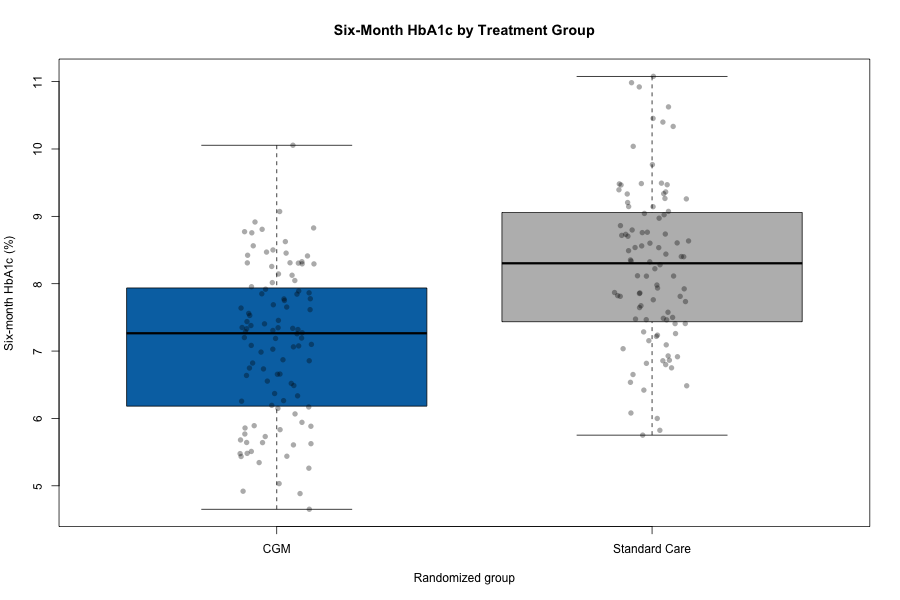

# Project 02 — CGM Randomized Trial Analysis

**Objective:** Estimate the six-month effect of continuous glucose monitoring (CGM) versus standard care on HbA1c in a hypothetical randomized trial.

**Methods:** Synthetic trial-data generation, baseline summary, adjusted ANCOVA, model diagnostics, and automated table and figure production.

**Tools:** R, linear regression, Git, HTML

**Primary estimand:** Adjusted mean difference in six-month HbA1c for standard care minus CGM among randomized participants.

**Deliverables:** [HTML report](docs/index.html) | [Analysis results](outputs/primary_analysis_results.csv) | [Baseline table](outputs/baseline_characteristics.csv) | [Source code](run_all.R)



## Key findings

- The synthetic cohort included 200 participants: 104 assigned to CGM and 96 to standard care.
- The adjusted standard-care minus CGM contrast was **0.76 HbA1c percentage points** (SE 0.07; p < 0.001), favoring CGM in the simulated data.
- Baseline HbA1c was strongly prognostic of six-month HbA1c, supporting the prespecified ANCOVA adjustment.

## Study design

- Parallel, two-arm randomized trial
- Synthetic adults with type 2 diabetes
- Measurements at baseline, three months, and six months
- Continuous primary endpoint: six-month HbA1c
- Covariate adjustment: baseline HbA1c, age, and sex

## Repository structure

```text
analysis/   original sequential coursework programs
data/       generated participant-level trial dataset
outputs/    baseline and regression tables
figures/    treatment-group HbA1c visualization
docs/       browser-ready report
run_all.R   validated end-to-end pipeline
```

## Reproduce

```bash
Rscript run_all.R
```

## Interpretation limits

The data and treatment effect are simulated. Randomization is represented in the data generator, but this project is a workflow demonstration and not evidence about CGM effectiveness.
