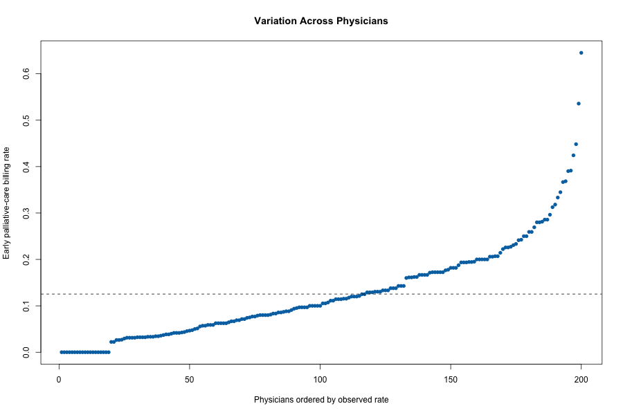

# Project 03 — Provider Variation & Fixed-Effects Analysis

**Objective:** Quantify physician- and organization-associated variation in early palliative-care billing after patient case-mix adjustment.

**Methods:** Hierarchical data simulation, patient case-mix regression, physician and organization fixed effects, residual-variation comparison, and adjusted logistic regression.

**Tools:** R, fixed-effects regression, logistic regression, Git, HTML

**Primary estimand:** Descriptive reduction in residual outcome variation after adding physician or organization fixed effects to the case-mix model.

**Deliverables:** [HTML report](docs/index.html) | [Variation metrics](output/variation_metrics.csv) | [Adjusted associations](output/adjusted_associations.csv) | [Source code](run_all.R)



## Key findings

- The synthetic hierarchical cohort contained 6,000 patients, 200 physicians, and 40 organizations.
- Early palliative-care billing prevalence was **12.5%**.
- Adding physician fixed effects reduced residual variation by **10.0%**, compared with **3.1%** for organization fixed effects.
- These descriptive differences demonstrate provider-level heterogeneity; they are not causal quality rankings.

## Study design

- Patients nested within physicians and organizations
- Binary endpoint: early palliative-care billing
- Patient case-mix: age, sex, comorbidity, and cancer type
- Provider features: integration and prior referral
- Organization feature: specialist availability

## Repository structure

```text
src/        preserved original simulation program
data/       generated patient-provider analytical dataset
output/     variation metrics and adjusted associations
figures/    physician variation visualization
docs/       browser-ready report
run_all.R   validated end-to-end pipeline
```

## Reproduce

```bash
Rscript run_all.R
```

## Interpretation limits

All records are synthetic. Fixed effects absorb provider-specific differences but do not identify causal provider performance, and residual-variance reductions are descriptive rather than formal ICC estimates.
