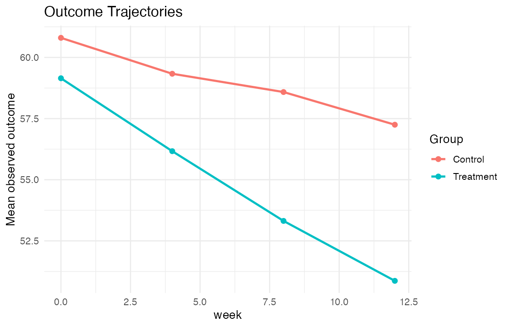

# Project 04 — Longitudinal Clinical Data Analysis

**Objective:** Estimate a week-12 treatment effect using repeated clinical measurements with incomplete follow-up.

**Methods:** Long-format data generation, missing-data indicators, baseline-adjusted week-12 ANCOVA, and subject-specific random-intercept mixed modeling.

**Tools:** R, `nlme`, mixed models, ggplot2, Git, HTML

**Primary estimand:** Adjusted treatment-minus-control mean difference at week 12.

**Deliverables:** [HTML report](docs/index.html) | [Model results](output/model_results.csv) | [Source data](data/longitudinal_trial.csv) | [Source code](run_all.R)



## Key findings

- The generated dataset contains 500 participants measured at weeks 0, 4, 8, and 12.
- Week-12 ANCOVA estimated a treatment difference of **−6.25** (95% CI −7.78 to −4.72).
- The repeated-measures mixed model produced a similar week-12 contrast of **−6.05** (95% CI −7.57 to −4.54).

## Study design

- Two treatment groups with four scheduled measurements
- Continuous longitudinal endpoint
- Subject-specific random intercept
- Missing-at-random scenario related to outcome and treatment
- Week 12 explicitly set as the reference visit for contrast extraction

## Repository structure

```text
data/       generated long-format clinical data
output/     ANCOVA and mixed-model estimates
figures/    group mean trajectories
docs/       browser-ready report
run_all.R   end-to-end analysis pipeline and checks
```

## Reproduce

```bash
Rscript run_all.R
```

## Interpretation limits

The mixed-model interpretation depends on the specified covariance structure and missing-at-random assumption. All data are synthetic.
