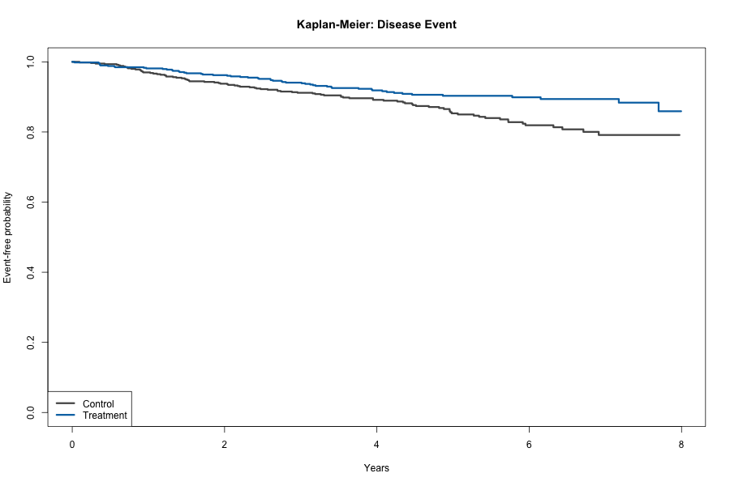

# Project 05 — Survival & Competing-Risk Analysis

**Objective:** Evaluate treatment association with time to a disease event when another event can occur first.

**Methods:** Time-to-event simulation, Kaplan–Meier estimation, adjusted cause-specific Cox regression, Schoenfeld-residual diagnostics, and Fine–Gray subdistribution regression.

**Tools:** R, `survival`, Cox regression, Fine–Gray modeling, Git, HTML

**Primary estimand:** Adjusted cause-specific hazard ratio for treatment versus control; the subdistribution hazard ratio is reported for absolute-risk-oriented sensitivity analysis.

**Deliverables:** [HTML report](docs/index.html) | [Model results](output/model_results.csv) | [PH diagnostics](output/proportional-hazards-check.txt) | [Source code](run_all.R)



## Key findings

- The synthetic cohort included 1,200 participants with censoring and two mutually exclusive event types.
- The adjusted cause-specific treatment hazard ratio was **0.63** (95% CI 0.45–0.88; p = 0.006).
- The Fine–Gray subdistribution hazard ratio was **0.61** (95% CI 0.44–0.85; p = 0.004).

## Study design

- Treatment and control cohort
- Disease event, competing other event, and right censoring
- Adjustment for age and baseline severity
- Separate etiologic and cumulative-incidence modeling perspectives
- Proportional-hazards diagnostic output retained for review

## Repository structure

```text
data/       generated time-to-event dataset
output/     Cox, Fine–Gray, and diagnostic results
figures/    Kaplan–Meier visualization
docs/       browser-ready report
run_all.R   end-to-end pipeline and checks
```

## Reproduce

```bash
Rscript run_all.R
```

## Interpretation limits

Cause-specific and subdistribution hazard ratios answer different questions and are not risk ratios. The simulated associations are not clinical evidence.
