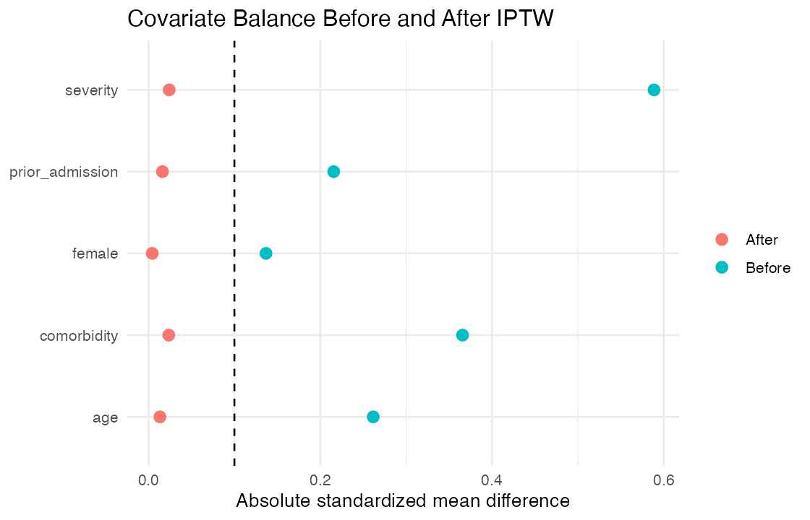

# Project 06 — Causal Inference in Observational Health Data

**Objective:** Estimate a treatment effect on clinical-outcome risk after addressing measured treatment-selection differences.

**Methods:** Propensity-score estimation, overlap assessment, stabilized inverse-probability weighting, percentile trimming, 1:1 nearest-neighbor matching, standardized mean differences, and risk-difference estimation.

**Tools:** R, propensity scores, matching, IPTW, ggplot2, Git, HTML

**Primary estimand:** Average treatment effect (ATE) on the risk-difference scale using stabilized IPTW; matching provides an ATT sensitivity estimate.

**Deliverables:** [HTML report](docs/index.html) | [Effect estimates](output/effect_estimates.csv) | [Balance table](output/covariate_balance.csv) | [Source code](run_all.R)



## Key findings

- The synthetic observational cohort included 3,000 participants with deliberately confounded treatment assignment.
- Stabilized IPTW estimated an ATE risk difference of **−4.2 percentage points** (95% CI −6.6 to −1.8).
- After trimming extreme weights, the estimate was **−3.8 percentage points** (95% CI −6.1 to −1.4).
- All weighted absolute standardized mean differences were below 0.03, compared with a maximum of 0.59 before weighting.

## Study design

- Observational treatment comparison with a binary outcome
- Prespecified confounders: age, sex, comorbidity, severity, and prior admission
- Stabilized ATE weights with 1st/99th percentile sensitivity trimming
- Matching-based ATT sensitivity analysis
- Balance assessed before outcome interpretation

## Repository structure

```text
data/       generated observational cohort
output/     effect estimates and balance diagnostics
figures/    Love plot
docs/       browser-ready report
run_all.R   end-to-end pipeline and checks
```

## Reproduce

```bash
Rscript run_all.R
```

## Interpretation limits

Causal interpretation requires consistency, positivity, correct model specification, and no unmeasured confounding. Synthetic data allow method demonstration but do not validate those assumptions in real-world data.
